# Extended Kalman Filter Sensor Fusion
## Video Demo
For both videos, please watch them at the highest res on Youtube.

See the demo with Odometry, imu and landmark detections [here](https://youtu.be/6gxRd_A1yz0).

See the demo only with Odometry and imu [here](https://youtu.be/yEdiKWycDxo).

## Rviz Visualization Explainations

  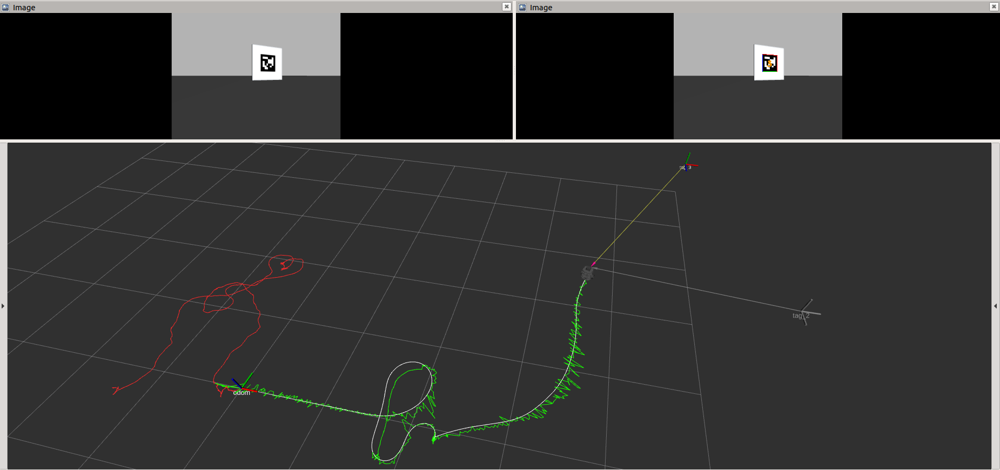

* The **top left** image is the raw image received from camera
* The **top right** image is the image with apriltag detection result
* The **white** line denotes the true path of the robot
* The **red** line denotes the path generated only by motion model prediction
* The **green** line denotes the path estimated by EKF
* The **frame axis marker** with color (top right) denotes the configuration of currently detected tag

  <b>Fig 1. Rviz Visualization</b> 

## Set Up
* Ubuntu 18.04
* ROS-melodic
* Turtlebot3-burger
* Raspberry Pi RGB Camera (with res at 320 x 240)

## Dependency
* [apriltag_ros](http://wiki.ros.org/apriltag_ros)
* Gazebo Camera Plugin
* Gazebo Imu Plugin
* [rqt_multiplot](https://github.com/ANYbotics/rqt_multiplot_plugin) (optional)
* [Eigen3](https://eigen.tuxfamily.org/dox/GettingStarted.html)

## Table of Contents
- [1. Project Objective](#Project-Objective)
- [2. Project Pipeline](#Project-Pipeline)
- [3. Motion Model and Measurement Models](#Motion-Model-and-Measurement-Models)
- [4. Experimental Results](#Experimental-Results)

## Project Objective
This project aims at implementing the Extended Kalman Filter (EKF) to track the robot state (which is (x, y, yaw)) in real time. The data from wheel encoder is used to predict the robot state in **motion model**. The **measurement model** utilizes the data from Apriltag landmark detection and the data from IMU sensor. The measurement of landmark is used to estimate the posterior from the prior generated by motion model. The measurement of yaw from IMU is used to further correctify the estimation of yaw.

Besides, since the data from all sensors are not synchronized, the time stamp of each sensor's measurement is handled to guarantee a correct logic in each filter's update.

## Project Pipeline

  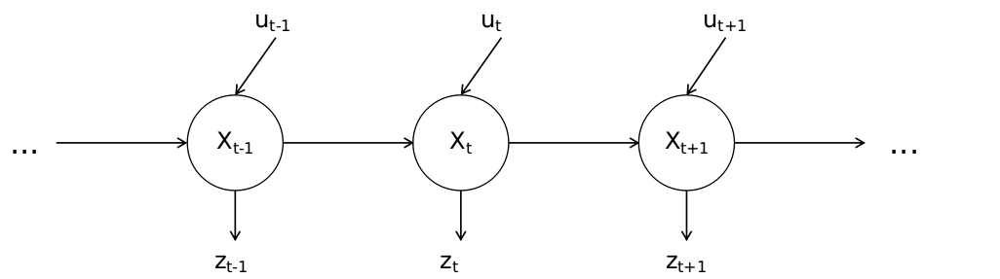

  <b>Fig 2. Hidden Markov Model </b> 

As is known, the underlying model behind Kalman Filters is Hidden Markov Model. However, since in this project we have multiple unsynchronized sensor measurements, we need to do some tricks on state update rules. A customized pipeline is shown as below:

  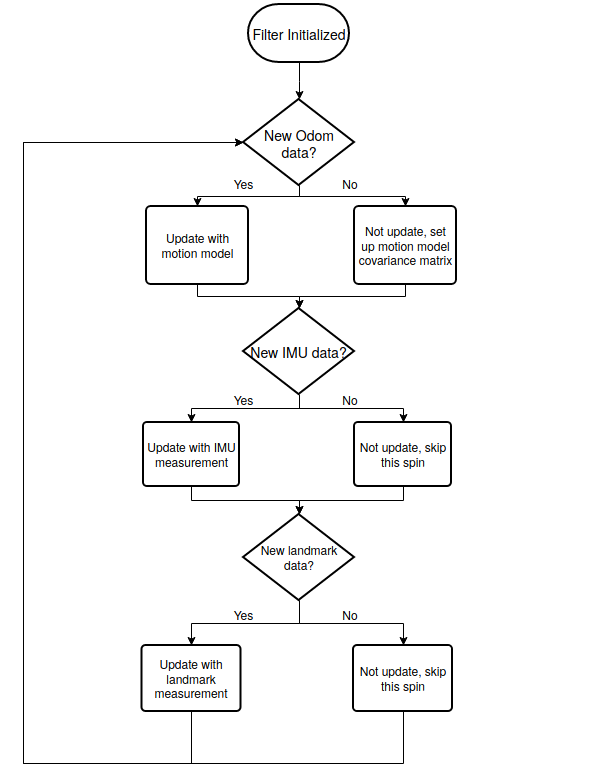

  <b>Fig 3. Project Pipeline </b> 

## Motion Model and Measurement Models
### Motion Model
Since this project is implemented in an ideal environment, the raw odometry is extremely accurate. For easy implementation and visualization, we consider the raw odometry as the gound truth.

  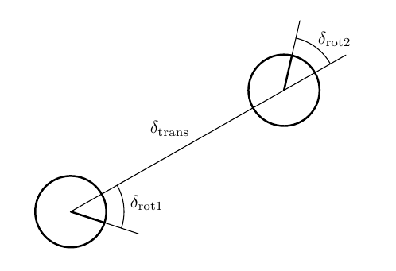

  <b>Fig 4. Motion Model </b> 

**Sample motion model odometry** (from Probabilistic Robotics P110) is used as motion model. As is explained in Probabilistic Robotics, using velocity in motion model prediction suffers from the mismatch between the actual motion controllers and its crude mathematical model, so alternatively, it is better to use odometry measurements as basis for calculating the robot's motion over time.

The difference (dx, dy, dyaw) between two raw odometry measurements is decomposed into (rot1, translation, rot2), which is then applied to the estimated state **Xt-1** from the last time stamp to generate a prior. Thus the jacobian matrix **G** of state space function **g(xt-1,ut)** is:

  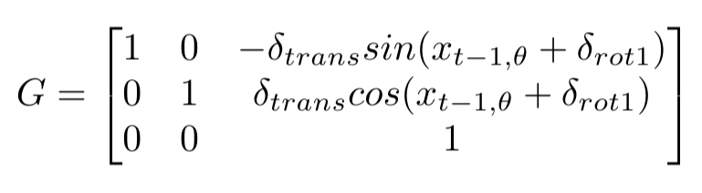

### Measurement Models
IMU and landmark detections measure the yaw angle and (x, y, yaw) respectively. Since they measure the state directly, they are considered as linear measurement models.

For IMU, since we use odometry measurement as motion model, the measured linear accelerations and augular velocities won't be used. In such case we only consider using its measurement of orientation. Thus the jacoian matrix of measurement function is just a constant: 1.

For Landmark detections, the [apriltag_ros](http://wiki.ros.org/apriltag_ros) package keeps boardcasting the poses of currently detected tags (relative to the **camera frame**).

  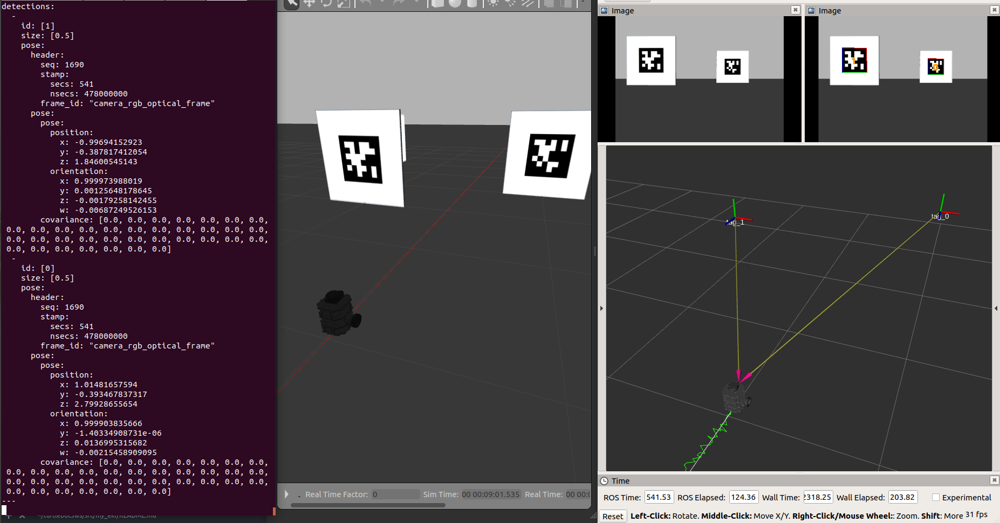

  <b>Fig 5. Landmark Measurement Model </b> 

For each detected landmark/tag, we can derive the pose of the robot **foot print frame** from:

  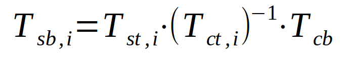

Where **i** denotes the id of the tag, **Tsb** denotes the pose of foot_print_frame in world frame, **Tst** denotes the tag pose in world frame, **Tct** is the measurement of the tag pose, **Tcb** denotes the pose of foot_print_frame in cmera camera frame. As **Tst** and **Tcb** are known, we can calculate the measured robot state **(xi, yi ,yawi)** with currently measurement **Tct,i**. In this case, since the measurement function is linear, the jacobian matrix **H** is a 3x3 diagonal matrix.

With all tag detactions, the filter is updated as follows:

  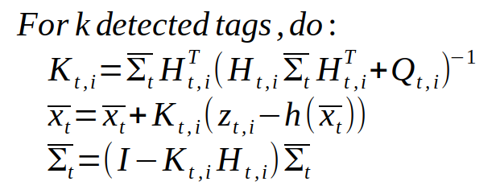

Where **i** denotes the tag id, **Kt,i** denotes the Kalman Gain, **Qt,i** denotes the covariance matrix of measurement, **h** denotes the measurement function.

This is a little different from the EKF algorithm in Probabilistic Robotics because we want to keep updating the prior in each iteration and then use them as the input for the next iteration. This happens in **sensor fusion**, where we treat the posterior, which is updated by the current sensor measurement, as the prior of the next sensor measurement's update. After all the updates, we finally get the estimated posterior:

  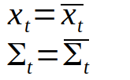

## Experimental Results
The error of Euclidean distance (in meters) and the error of yaw (in radius) between estimated odometry and the true odometry are plotted in real time by using rqt_multiplot. For comparison, those errors between the odometry only updated by the motion model and the true odometry are also presented.

### Fuse Odometry, IMU and Landmark detections

  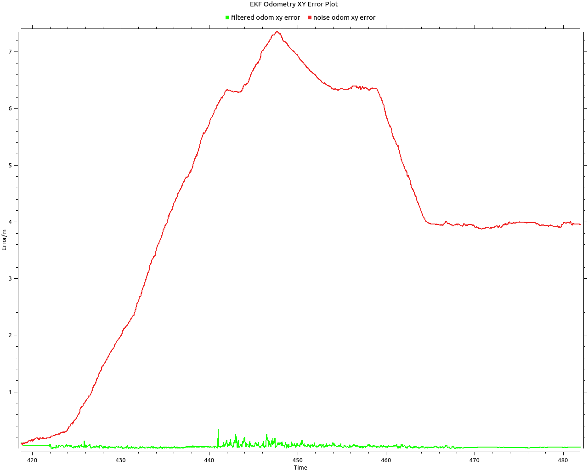

  <b>Fig 6(a). Euclidean distance error </b> 

  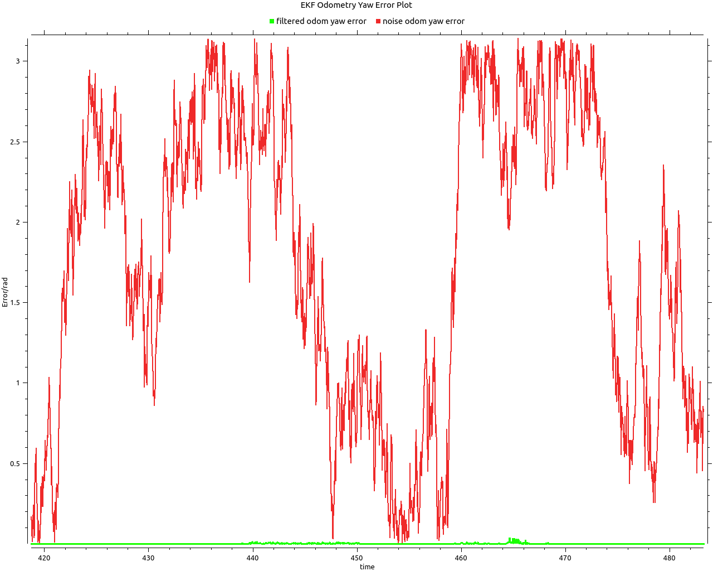

  <b>Fig 6(b). Yaw angle error </b> 

### Fuse Odometry and IMU

  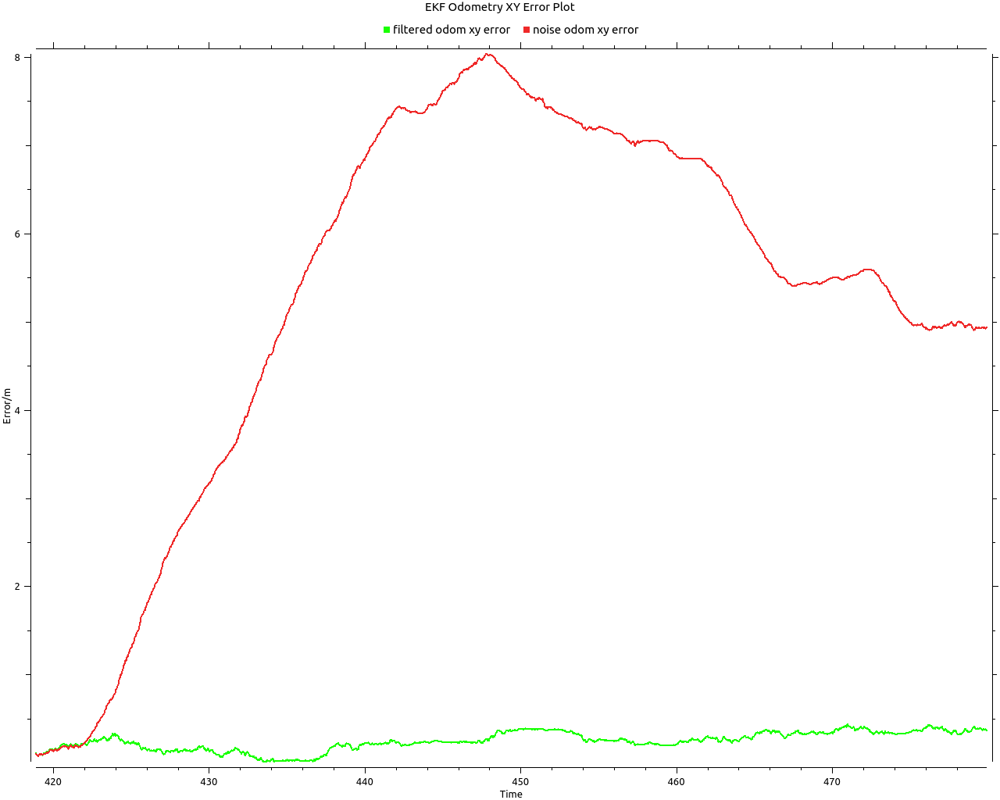

  <b>Fig 7(a). Euclidean distance error </b> 

  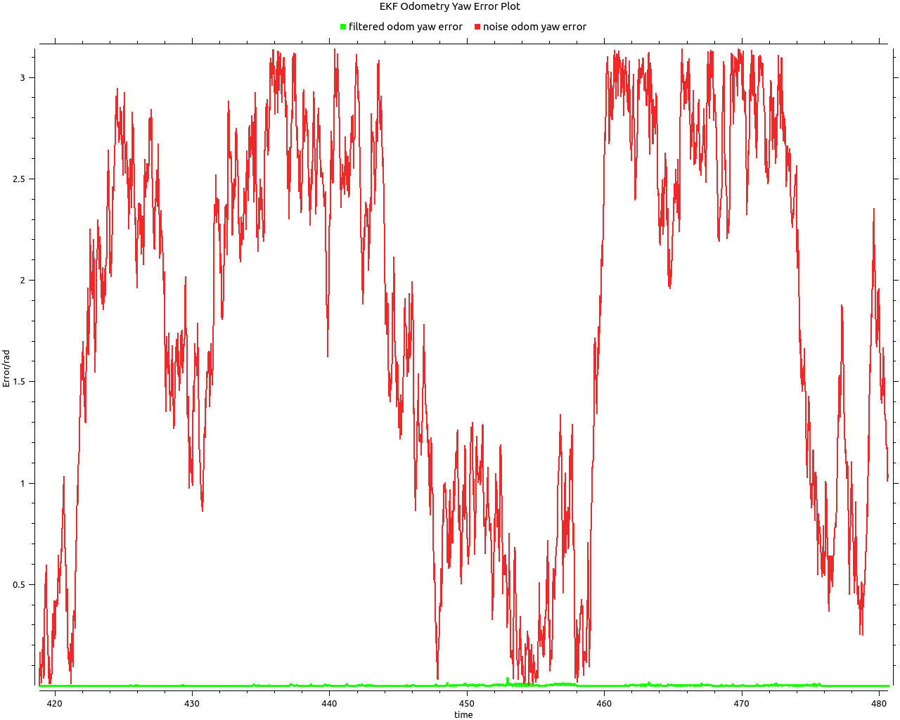

  <b>Fig 7(b). Yaw angle error </b> 

From the result, we can observe that the odometry which purely based on motion model is quite noisy. With IMU measurement, the yaw angle measurement becomes accurate, which in the meanwhile also improves the accuracy of (x, y). Finally, with landmark detections, all the tracked state variables become accurate. From Fig 6(a), the Euclidean error of (x,y) fluctuates because the measurement of landmark detections runs at a lower frequency than the filter spin. Once the detections available, the error diminishes.
